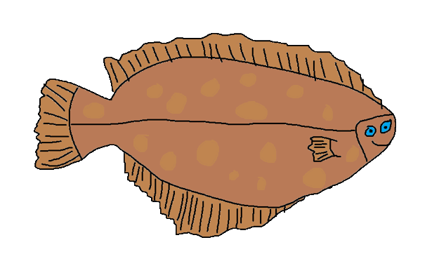

# Flounder

Flounder is a chess engine created in Rust. Don't let its looks deceive you!

## Board Representation
- [Bitboards](https://www.chessprogramming.org/Bitboards)

## Move Generation
- [Magic Bitboards](https://www.chessprogramming.org/Magic_Bitboards)

## Search
- [Negamax with Alpha-Beta Pruning](https://www.chessprogramming.org/Alpha-Beta)
- [Quiescence Search](https://www.chessprogramming.org/Quiescence_Search)
- [Iterative Deepening](https://www.chessprogramming.org/Iterative_Deepening)

## Move ordering
- [PV-Move](https://www.chessprogramming.org/PV-Move)
- [Hash Move](https://www.chessprogramming.org/Hash_Move)
- [MVV-LVA (Most Valuable Victim - Least Valuable Aggressor)](https://www.chessprogramming.org/MVV-LVA)

## Evaluation
- [Material Counting](https://www.chessprogramming.org/Material) 
- [Piece-Square Tables](https://www.chessprogramming.org/Piece-Square_Tables) 

## Other
- [Transposition Table](https://www.chessprogramming.org/Transposition_Table) 
- [Zobrist Hashing](https://www.chessprogramming.org/Zobrist_Hashing) 

## Future Work
- [Principal Variation Search](https://www.chessprogramming.org/Principal_Variation_Search) 
- [Killer Move Heuristic](https://www.chessprogramming.org/Killer_Move) 
- [Null Move Pruning](https://www.chessprogramming.org/Null_Move_Pruning) 
- [Late Move Reductions](https://www.chessprogramming.org/Null_Move_Pruning) 
- [Time Management](https://www.chessprogramming.org/Time_Management) 