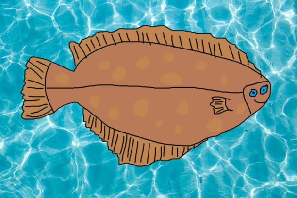

# Flounder

Flounder is a chess engine created in Rust. Don't let its looks deceive you!

## Board Representation
Flounder uses a 0x88 square centric board

## Search
TODO: 
- Alpha-beta search
- Quiescence search
- PVS

## Move ordering
TODO:
- TT Move priority
- Killer moves

## Evaluation
TODO:
- Material counting
- Piece-Square tables
